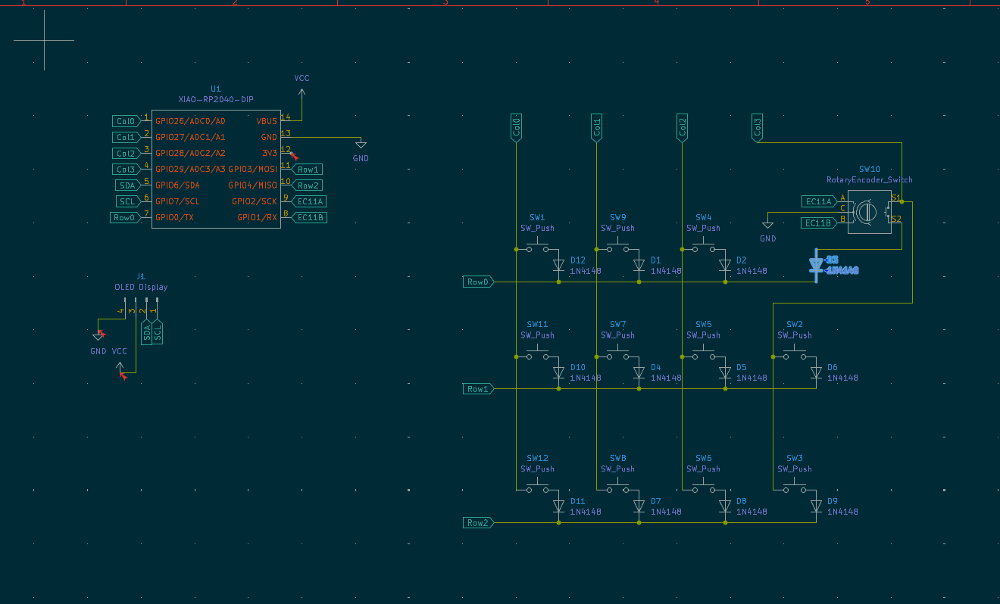
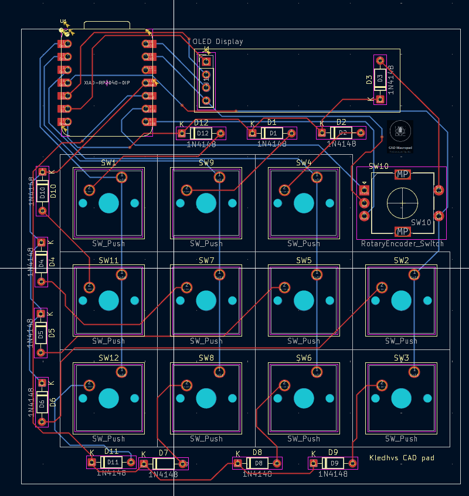
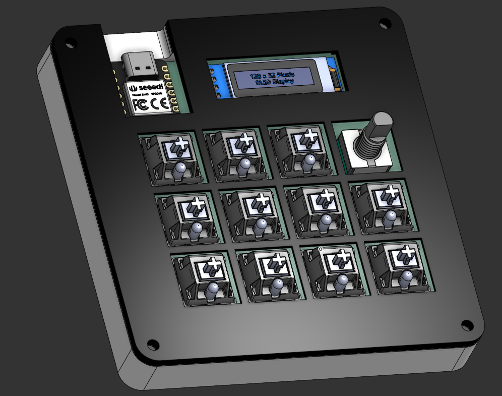

# CADpad
Macropad designed from scratch for cad, media, and coding. Along with a custom script to run badapple on the oled screen!  
Note that the pcb has the scl and sca pins mixed up on it, I just cut the traces and ran a wire around it.  
  
Key Features  
Macropad with 11 reprogrammable keys  
oled screen that displays layers and animations  
rotary encoder that interfaces with computer  
interface with the computer for input and output  
And of course, it can run bad apple  

BOM  
12x 1n4148 Diodes  
1x EC11 Encoders  
1x 0.91 in OLED display  
11x DSA keycaps  
11x Cherry MX Keycaps  
1x XIAO RP2040  
1X Case (3d Printed)  
4x M3 16mm screws  
4x M3x5mmx4mm Heat Inserts  